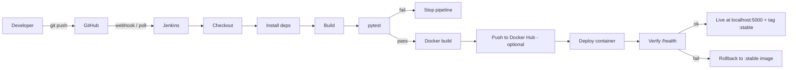

# Automated CI/CD Pipeline using Jenkins, Docker and GitHub

Flask app + Jenkinsfile that builds, tests, containerizes, deploys, verifies and (on failure) rolls back automatically on every push to GitHub.

## Architecture



## Project layout

```
app/                Flask app (app.py, templates/, static/)
tests/              pytest test cases
scripts/            verify.py (health check), rollback.ps1 / rollback.sh
monitoring/         Optional Prometheus + Grafana (docker compose)
Dockerfile          Container image
Jenkinsfile         Pipeline (8 stages + rollback)
requirements.txt
```

App endpoints: `/` (home), `/status`, `/api/info` (JSON), `/health`, `/metrics` (Prometheus).

## 1. Software to install (Windows)

| Tool | Purpose | Link |
|---|---|---|
| Python 3.10+ | Run app and tests (tick "Add to PATH") | python.org |
| Git | Version control | git-scm.com |
| Docker Desktop | Containers (WSL2 backend) | docker.com |
| JDK 17 | Needed by Jenkins | adoptium.net |
| Jenkins LTS (Windows installer) | CI/CD server, runs on port 8080 | jenkins.io |
| GitHub account | Repository | github.com |
| ngrok (optional) | Lets GitHub webhooks reach local Jenkins | ngrok.com |

## 2. Run the app locally (no Docker, no Jenkins)

```
cd flask-cicd-project
python -m venv venv
venv\Scripts\activate          (Linux/macOS: source venv/bin/activate)
pip install -r requirements.txt
pytest tests
python app/app.py
```
Open http://localhost:5000

## 3. Run it with Docker

```
docker build --build-arg APP_VERSION=1.0.0 -t flask-cicd-app .
docker run -d --name flask-cicd-container -p 5000:5000 flask-cicd-app
```
Open http://localhost:5000. Stop with `docker rm -f flask-cicd-container`.

## 4. Push to GitHub

```
git init
git add .
git commit -m "Initial commit"
git branch -M main
git remote add origin https://github.com/<your-username>/flask-cicd-project.git
git push -u origin main
```

## 5. Configure Jenkins

1. Open http://localhost:8080, unlock with the initial admin password, install suggested plugins.
2. Make sure the plugins **Pipeline**, **Git**, **GitHub**, **JUnit** are installed (Manage Jenkins > Plugins).
3. Jenkins runs as the "Local System" service account by default. Docker Desktop must be running. If `docker` is not found in builds, restart the Jenkins service after installing Docker (Services > Jenkins > Restart) so PATH is refreshed. If you get Docker permission errors, run the Jenkins service as your own Windows user (Services > Jenkins > Log On).
4. New Item > **Pipeline** > name `flask-cicd-pipeline`.
5. Under *Pipeline*: Definition = **Pipeline script from SCM**, SCM = Git, Repository URL = your GitHub repo, Branch = `*/main`, Script Path = `Jenkinsfile`.
6. Under *Build Triggers* tick **GitHub hook trigger for GITScm polling** (webhook) and/or **Poll SCM** `H/2 * * * *`.
7. Save and click **Build Now**.

The first build may show an "unknown parameter" quirk: run it once, then use **Build with Parameters** afterward.

## 6. Trigger on every push

- **Easy (no public URL):** the Jenkinsfile already polls GitHub every ~2 minutes (`pollSCM`).
- **Instant webhook:** run `ngrok http 8080`, then in GitHub: Repo > Settings > Webhooks > Add webhook, Payload URL `https://<ngrok-id>.ngrok-free.app/github-webhook/`, content type `application/json`, event "Just the push event".

## 7. Demonstrate automated updates

1. Edit the message in `app/app.py` (home route) or the wording in `index.html`.
2. `git add . && git commit -m "Update homepage" && git push`
3. Watch Jenkins start a build, then refresh http://localhost:5000. The version shown changes to `1.0.<build number>`.

## 8. Test failure handling and rollback

- **Failed test stops the pipeline:** change an assertion in `tests/test_app.py` (e.g. expect `b"Goodbye"`), push. The build fails at *Automated Testing* and nothing is deployed; the old container keeps running.
- **Failed deployment rolls back:** in the `Dockerfile` change `app:app` in the `CMD` line to `app:wrong` and push. Tests still pass and the image builds, but the container crashes, so *Deployment Verification* fails and the `post { failure }` block restarts `flask-cicd-app:stable` (the previous working version). Revert the change afterwards.
- **Manual rollback:** `scripts\rollback.ps1` (Windows) or `scripts/rollback.sh`.

How it works: after every verified deployment the image is tagged `:stable`. Each new build is deployed, health-checked, and only then promoted to `:stable`.

## 9. Publish to Docker Hub (optional)

1. Jenkins > Manage Jenkins > Credentials > Global > Add: *Username with password*, ID `dockerhub-creds`.
2. Build with Parameters: tick `PUBLISH_IMAGE`, set `DOCKERHUB_USER`.

## 10. Monitoring and logs

- Jenkins shows build history, stage view, console logs and test results (JUnit trend graph).
- App availability: `/health`. Container logs: `docker logs flask-cicd-container`.
- Optional Prometheus + Grafana:
  ```
  cd monitoring
  docker compose up -d
  ```
  Prometheus: http://localhost:9090 (check Status > Targets). Grafana: http://localhost:3000 (admin/admin) > Add data source > Prometheus > URL `http://prometheus:9090`, then build a panel on `app_requests_total` or `app_up`.

## Troubleshooting

| Problem | Fix |
|---|---|
| `docker` not recognized in Jenkins | Start Docker Desktop, restart Jenkins service |
| `python` not recognized in Jenkins | Install Python for all users with PATH, restart Jenkins service |
| Port 5000 already in use | Change `HOST_PORT` in the Jenkinsfile |
| Docker permission denied | Run Jenkins service as your user |
| Webhook shows 403 | Add trailing slash `/github-webhook/`, ensure ngrok is running |

## Future enhancements
Deploy to AWS, Kubernetes, SonarQube and Trivy scans, deployment notifications (email/Slack).
